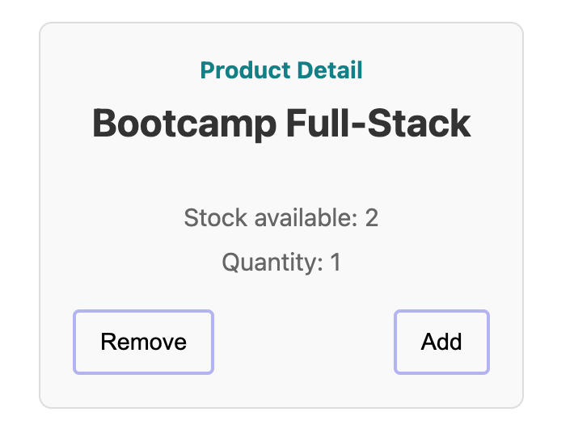

# KATA: USER INTERACTION

## OBJECTIVE

This exercise consists of simulating user interaction with the component. To do this, we will use `userEvent`.
The difficulty of this exercise increases. We are not just expecting the show responsibility, we are simulating in a
non-browser environment how a user interacts with our component.



### STEPS:

- Follow the instructions described within the test body.
- Import the necessary functions to perform the test.
- Check you have an async test to be able to use the API of `userEvent`.
  - Run the test with the script ```npm run test:kata-3```
  - Output the test results:
    - ❌ If the test fails, read the error message and try to understand what is failing. Fix the error and run the test
      again.
    - ✅ If the test passes, congratulations! However, if it passed on the first try, you should check if it was a false
      positive, so you should break the test. That is, make it fail for the reason you expect.
      - Try to remove the interaction of the user and check if the test fails.

#### File to edit in the kata 👇:

- [Product Card Test](../../../src/katas/kata-3/ProductCard.test.tsx)

#### 🔎 Hint:

[Writing test with userEvent](https://testing-library.com/docs/user-event/setup#starting-a-session-per-setup)
