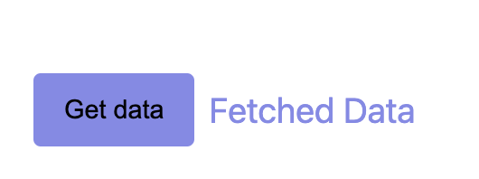

# KATA: Wait for an element to appear when an async action is performed

## Objective

This exercise is to search for an element in the DOM that takes time to appear after being shown following an
asynchronous request.

## Information about the AsyncButton component

- It contains a button that, when clicked, makes an asynchronous request. When the response arrives after a few seconds,
  a feedback message `Fetched Data` appears.
- The message is not always present, only when the request has been made and the response has arrived.



### STEPS:

- Follow the instructions described within the test body.
- Import the necessary functions to perform the test.
- Ensure you have an async test to be able to use the `userEvent` API and the async `find` method of `screen`.
  - Run the test with the script ```npm run test:kata-3```
  - Output the test results:
    - ❌ If the test fails, read the error message and try to understand what is failing. Fix the error and run the test
      again.
    - ✅ If the test passes, congratulations! However, if it passed on the first try, you should check if it was a false
      positive, so you should break the test. That is, make it fail for the reason you expect.
      - Try to replace `findBy` with `getBy` and check if the test fails.

#### File to edit in the kata 👇:

- [Async Button test](../../../src/katas/kata-4/AsyncButton.test.tsx)
